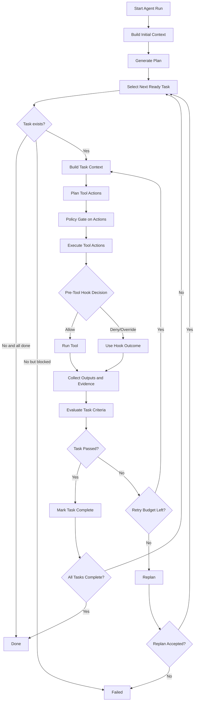

# ForgeTauri

Core-first agent runtime (TypeScript, NodeNext ESM).

## Agent Core: Real Execution Flow

This repository uses a **plan-first runtime** in `src/core/**`.
Core does not hardcode workflow tools. Tools/policies/middlewares are injected by profile/entry composition.

### Core roles

- `runCoreAgent` (`src/core/agent/flow/runAgent.ts`)
  - bootstraps `AgentState`, `ToolRunContext`, runtime paths, context engine, audit
  - installs middleware (`applyMiddlewares`)
  - creates planner and starts orchestrator loop
- `runPlanFirstAgent` (`src/core/agent/flow/orchestrator.ts`)
  - generates initial `Plan`
  - runs turn loop until `done` or `failed`
- `runTurn` (`src/core/agent/flow/turn.ts`)
  - picks next executable task by dependency
  - executes that task with retries
- `runTaskWithRetries` / `runTaskAttempt`
  - asks planner for tool calls for one task
  - executes tool calls
  - evaluates success criteria
  - retries or triggers replan when needed
- `executeActionPlan` / `executeToolCall` (`src/core/agent/execution/executor.ts`)
  - policy gate + schema parse + hook interception + tool run + criteria check

## Plan / Milestone / Task

- **Plan**: global execution graph from planner (`version=v1`, ordered tasks with dependencies and success criteria).
- **Task**: smallest schedulable unit. A turn executes one ready task.
- **Milestone**: not a separate core type; represented by completion progress across task groups.

## Single Task Lifecycle (Actual Runtime Path)

1. **Task selection**
   - `runTurn` selects next ready task (`getNextReadyTask`) from plan dependencies.
2. **Context construction**
   - `ContextEngine` builds packet for `phase="toolcall"` with latest evidence, relevant code, changes, memory.
3. **Tool-call planning**
   - planner returns tool calls for the selected task.
   - `gateToolCalls` enforces max tool calls and action budget.
4. **Tool execution**
   - for each tool call, executor does:
     - allowed-tools policy check
     - tool existence check
     - input schema parsing
     - `hooks.onBeforeToolCall` decision
       - `allow`: continue
       - `deny`: fail current call
       - `override_call`: execute replaced call
       - `override_result`: skip run and use injected result
     - run tool
     - merge `touchedPaths` and `patchPaths`
     - call hooks: `onPatchPathsChanged`, `onToolResult`
5. **Criteria review**
   - evaluates task `success_criteria`:
     - `tool_result`
     - `file_exists`
     - `file_contains`
     - `command` (subject to allowed-commands policy)
6. **Retry or complete**
   - if criteria pass: task marked completed
   - if fail: retry up to policy limit
   - if retries exhausted: enter replan path (`handleReplan`)
7. **Terminal decision**
   - all tasks completed -> `done`
   - unrecoverable error / max turns / replan failure -> `failed`

## Plan -> Task Execution (Mermaid)

## Middleware + HITL in this architecture

Core exposes generic hooks:
- `onBeforeToolCall`
- `onToolResult`
- `onPatchPathsChanged`

HITL is implemented outside core (`src/middleware/humanInTheLoop.ts`):
- wraps `ctx.runCmdImpl` for `command_exec` review
- gates selected patch tools via `onBeforeToolCall` for `patch_apply` review

## Audit and Replay

Core records:
- plan proposal data
- per-task tool call plan and results
- context packet references
- evidence references
- final run result (`done` / `failed`)

This enables post-run diagnosis of why a task passed, retried, replanned, or failed.
